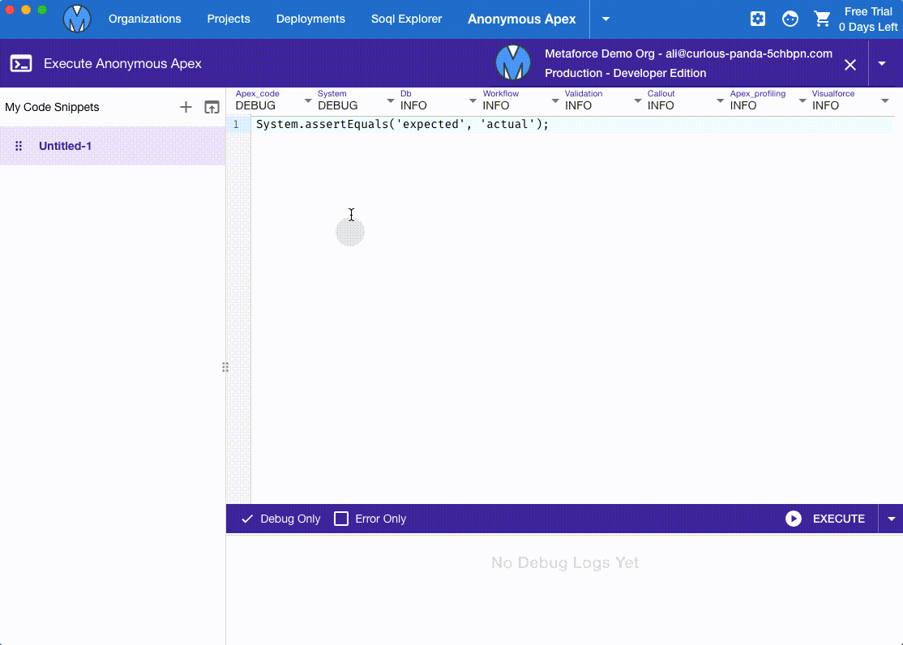

# Anonymous Apex

-   In many cases, we need to run a temporary apex script to start a batch job, process records, etc. In metaforce, you can use "Anonymous Apex" to run your apex scripts and quickly view the debug log.
-   Set debug levels before executing your apex script so that you can view apex logs in particular debug levels.
-   Metaforce can also save your scripts so that you can easily re-use them next time.

