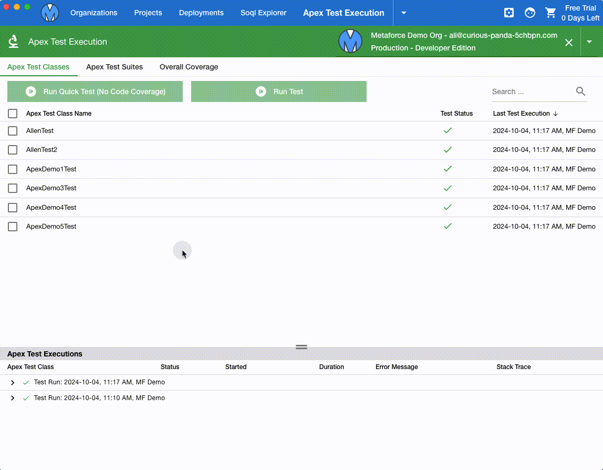

# Apex Test Execution

-   `Apex Test Classes`: view all your apex test classes and execute apex tests via few clicks.
-   `Apex Test Suites`: create apex test suites to group your apex test classes, and run apex tests per test suite group.
-   `Overall Coverage`: view the total test coverage of your organization and preview detailed coverage for each apex class.

