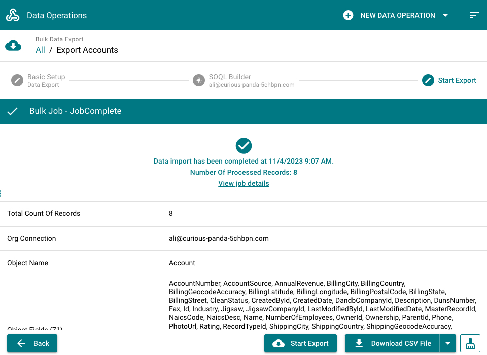
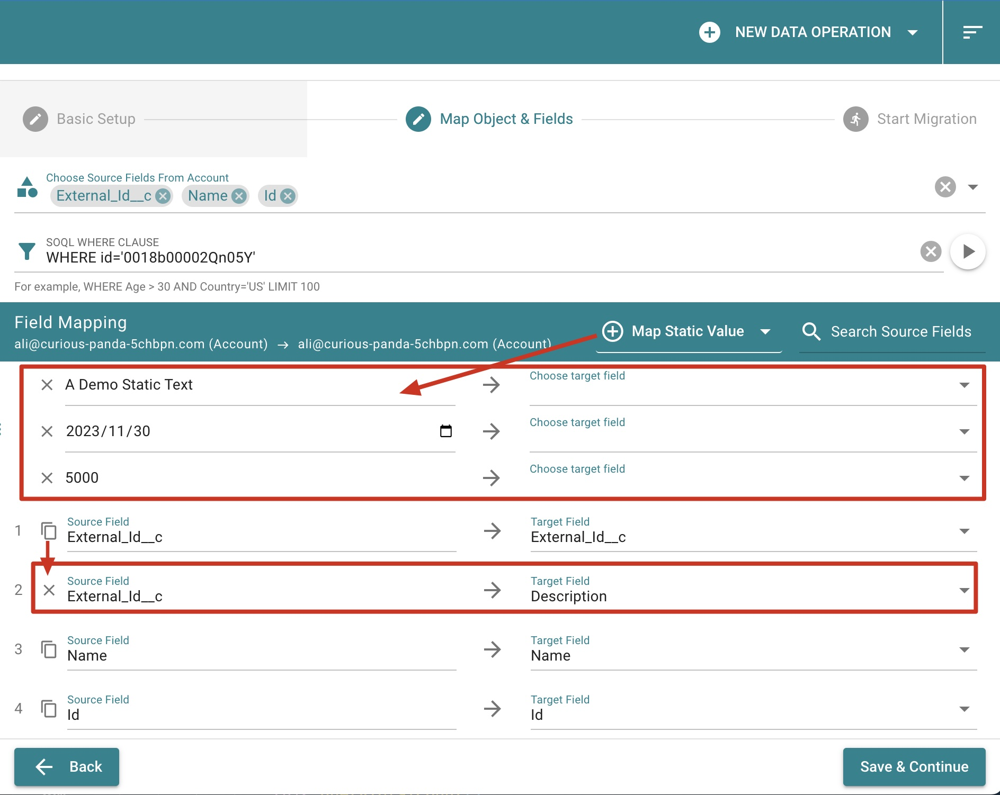

# Data Operations

## Export records via bulk api 2.0

Compared with dataloader or other tools, Metaforce provides a better experience to start a bulk export job in a super easy way.

Open metaforce and follow steps to export your data now!

1.  Name your export operation and choose the org connection
2.  Choose object & fields, and set soql where clause to filter records.
    

    > [!Tip|style:flat|label:Tips]
    >
    > 1. For soql where clause, it must starts with the "where" keyword. For example, `WHERE CreatedDate > Last_Year ORDER BY LastModifiedDate DESC LIMIT 1000`.

3.  Start the export, view export job result, and download the csv file.
    

## Import records via bulk api 2.0

Compared with dataloader or other tools, Metaforce provides a better experience to start a bulk import job in a super easy way.

### CSV Fields Mapping

-   Click `Auto Match Fields` button to auto map csv header with object fields.
-   `The 'read-only' field can't be mapped`, like formula fields, system fields, etc.
-   `External lookup is supported.` You can choose an external id field on the lookup object to populate the lookup field automatically.

### Preview Import Info

Before starting the data import, please review following settings to.

-   If you're doing insert or upsert, please always exclude the "Id" field from your mapping.
-   Make sure mappings between csv header and object field are accurate.

## Data Migration via REST API

Instead of exporting & importing CSV files, the Data Migration helps you to `move salesforce records directly from the source org to the target org`. For example, you need to migrate records from production/uat org to a dev/partial sandbox.

### 3 migration action types

-   `Insert` - insert records as new in the target org.
-   `Update` - Update records based on the record id in the target org.
-   `Upsert` - Upsert records based on selected external Id field on the target object.

### Field mappings

After choosing source fields, you need to match them with corresponding target fields on the target object.

Metaforce provides some special mapping abilities:

-   **Map Static Value**  
    You can map a static value to a target field, like a text, date, number.
-   **Duplicate source field**  
     Click the "Copy" icon ahead of source field to map a source field value to multiple target fields.

> [!NOTE]
> For target field picklist, only creatable/updatable fields will be listed. Please `make sure you have "Edit" permission` for fields if you can't find them in the picklist.

> [!TIP]
> Once the migration starts, your records will be processed via salesforce rest api. The salesforce rest api can only process 200 records at maximum per request. `If you have 200+ records, it will be separated into multiple requests and processed one by one`.

