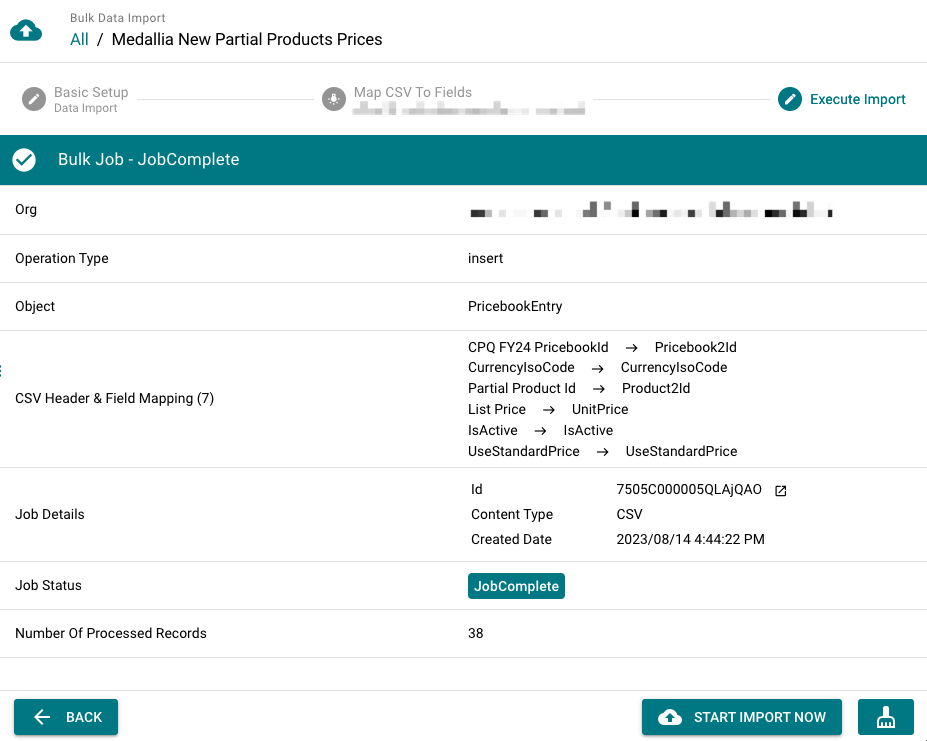

# Data Operations

## Bulk Export via Bulk API

Export salesforce records as CSV file via Bulk API via 3 steps below:

1. Choose a salesforce org connection
2. Choose an object & fields, set where conditions to filter your records.
3. Review your export info and Start it.

> [!NOTE|label:Add child-to-parent relationship field]
> To export a child-to-parent field, you can input the relationship field name and press `Enter` as below. For example, input "CreatedBy.Name" and press "Enter".
> 

## Bulk Import via Bulk API

Import your csv data into salesforce via Bulk API.

### CSV Fields Mapping

-   Click `Auto Match Fields` button to auto map csv header with object fields.
-   `The 'read-only' field can't be mapped`, like formula fields, system fields, etc.
-   `External lookup is supported.` You can choose an external id field on the lookup object to populate the lookup field automatically.

### Preview Import Info

Before starting the data import, please review following settings to.

-   If you're doing insert or upsert, please always exclude the "Id" field from your mapping.
-   Make sure mappings between csv header and object field are accurate.

## Data Migration via REST API

This feature helps you to move salesforce records directly from the source org to the target org.

It supports 3 data migration types:

-   `Insert` - insert records as new in the target org.
-   `Update` - Update records based on the record id.
-   `Upsert` - Upsert records based on selected external Id field.
