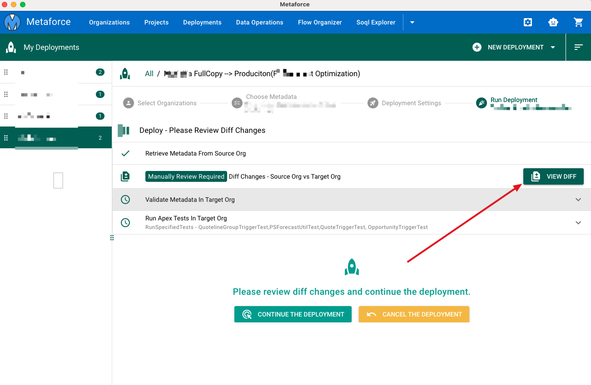

# Deployments

Metaforce Deployment helps you to perform a quick deployment from a source org to a target org.

## Start a deployment with 4 steps

-   Choose source & target org
-   Choose metadata components
-   Set deployment options
    -   Set deployment test level
    -   Set diff changes (`Always check this option to avoid code override`)
    -   Set deployment type
-   Start the deployment, Monitor Status, View results.

## Deployment Options

### Diff Changes

Before deploying your changes into production directly, the Diff Changes option helps you to easily compare all selected components between the source org and the target org.

-   Once the "Diff View" option is checked, you have to review all diff changes and continue the deployment by clicking `Continue The Deployment` button.
    
    
-   If there are any unexpected changes, you can click the `Cancel The Deployment` button to avoid data override.

### Test Level

-   `Default` - When deploying to production, all tests, except those that originate from managed packages, are executed if your deployment package contains Apex classes or triggers. If your package doesn’t contain Apex components, no tests are run by default.
-   `NoTestRun` - This test level applies only to deployments to development environments, such as sandbox, Developer Edition, or trial organizations. This test level is the default for development environments.
-   `RunSpecifiedTests` - Only the tests that you specify in the runTests option are run. Code coverage requirements differ from the default coverage requirements when using this test level. Each class and trigger in the deployment package must be covered by the executed tests for a minimum of 75% code coverage. This coverage is computed for each class and triggers individually and is different than the overall coverage percentage.
-   `RunLocalTests` - All tests in your org are run, except the ones that originate from installed managed and unlocked packages. This test level is the default for production deployments that include Apex classes or triggers.
-   `RunAllTestsInOrg` - All tests are run. The tests include all tests in your org, including tests of managed packages.

### Deploy Action Type

There are 3 deployment action types

-   `Validation` - Validate all selected metadata components only in the target org, instead of deploying them.
-   `Deploy` - Deploy all selected components into the target org.
-   `Destructive` - Delete all selected components from the target org.
