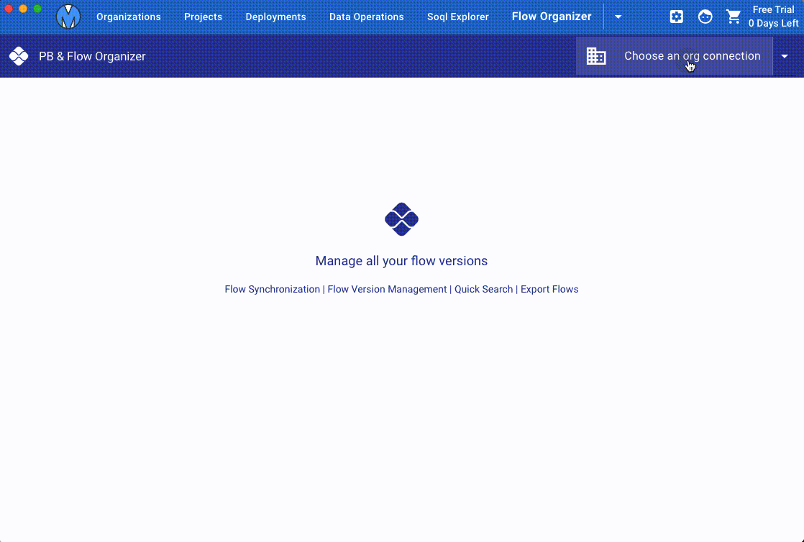
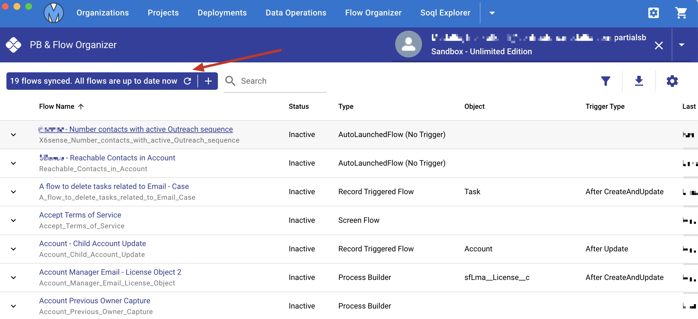
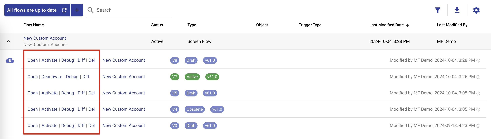

# Flow Organizer

Metaforce Flow Organizer helps you to manage all your flows and flow versions in a single view.

In flow organizer, you can quickly filter, sort all flows.

-   **Flow Name**: shows flow name and api name both.
-   **Flow Status**: indicates the flow is active or not.
-   **Type**, there are 4 common flow types:
    1. AutoLaunchedFlow
    2. Screen Flow
    3. Record Triggered Flow
    4. Process Builder
-   **Object**: the object name where the record triggered flow is based on.
-   **Trigger Type**: indicates when a record trigger flow get triggered.
-   **Last Modified**: last modified user and date.

## Auto Flow Sync

Everytime you open the flow organizer or click the `Fetch Latest Flow Updates` button, all latest active flow updates will be retrieved and saved on local by default.

-   Click flow name to open the flow definition detail in the browser

> The flow organizer auto fetch latest flow updates while the flow organizer page is open or refreshed.

## Actions On The Flow Version

Expand a flow to view flow versions.  
By default, the most recent 5 flow versions will be fetched. If you want to load all flow versions, click the "`Retrieve all flow versions`" button.

> Tips: click "Last Modified Date" column to keep the latest updated flow on the top, then you can easily find the flow you're working on.

