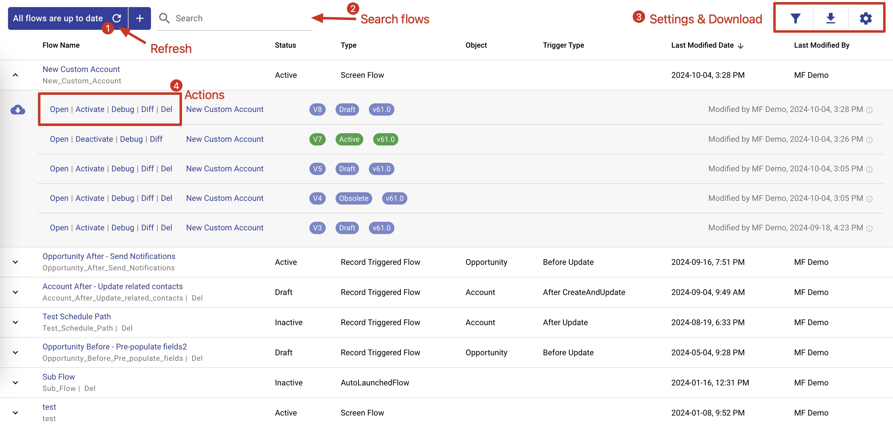
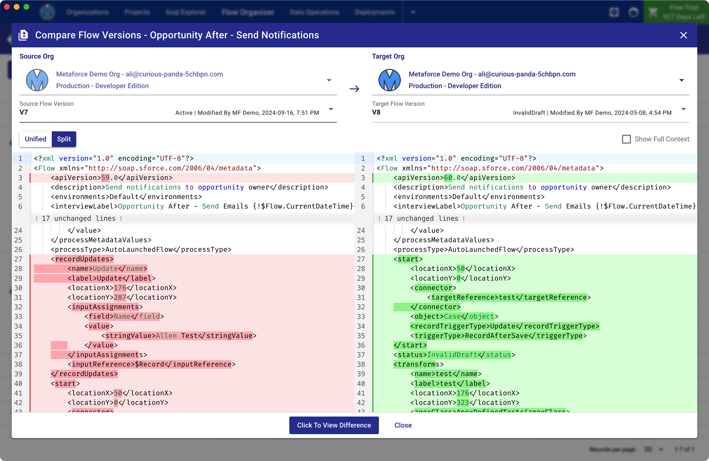

# Flow Organizer

Metaforce Flow Organizer helps you to manage all your flows and flow versions in a single view. Whenever the user opens the flow organizer or clicks the `Refresh` button at the top, Metaforce fetches latest flow version updates.

Here are flow organizer table columns:

-   **Flow Name**: shows flow name and flow api name both.
    1. The flow name is a clickable link and it will `redirect to flow detail page in salesforce` when the user clicks it.
    2. The flow API name is a clickable text and it will `be copied to clipboard` so that the user can easily paste the api name for other purposes.
-   **Flow Status**: indicates the flow is active or not.
-   **Type**, there are 4 common flow types:
    1. AutoLaunchedFlow
    2. Screen Flow
    3. Record Triggered Flow
    4. Process Builder
-   **Object**: the object name where the record triggered flow is based on.
-   **Trigger Type**: indicates when a record trigger flow get triggered.
-   **Last Modified**: last modified user and date.

> All columns can be sorted by clicking the column header. By default, the table is sorted by Last Modified Date(descending).

## Actions On The Flow Version

By default, the most recent 5 flow versions will be fetched for the display. If the flow has many old versions, click the "`Retrieve all flow versions`" button to list all of them.

> Tips: click "Last Modified Date" column header to keep the latest updated flow on the top, then you can easily find the flow you're working on.

Avaiable flow actions:

-   `Open`: open current flow version and redirects to the flow builder in the salesforce.
-   `Active/Deactivate`: toggle flow status.
-   `Debug`: open the debug page for current flow version.
-   `Diff`: compare current flow version with a specified flow version in current or another salesforce org.
-   `Del`: remove current flow version.

## Flow Version Diff View

The "Diff" action lets users easily see the differences between the source and target flow versions. They can choose a different version of the same flow for the target, or even pick a flow version from a different org.

