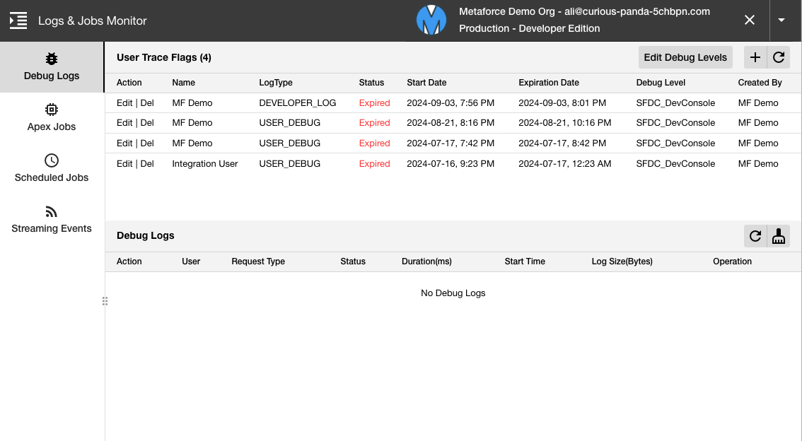
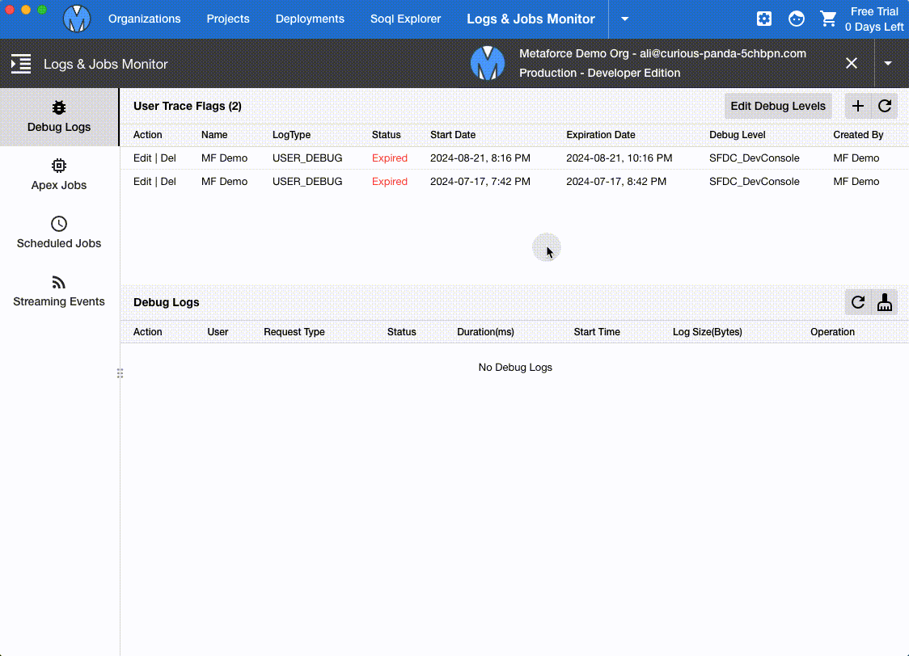
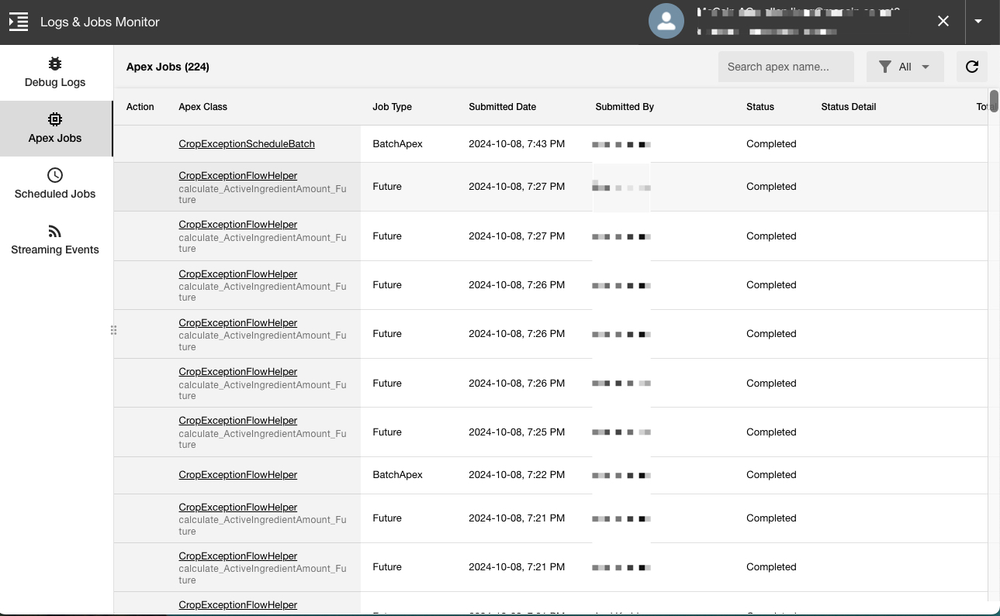
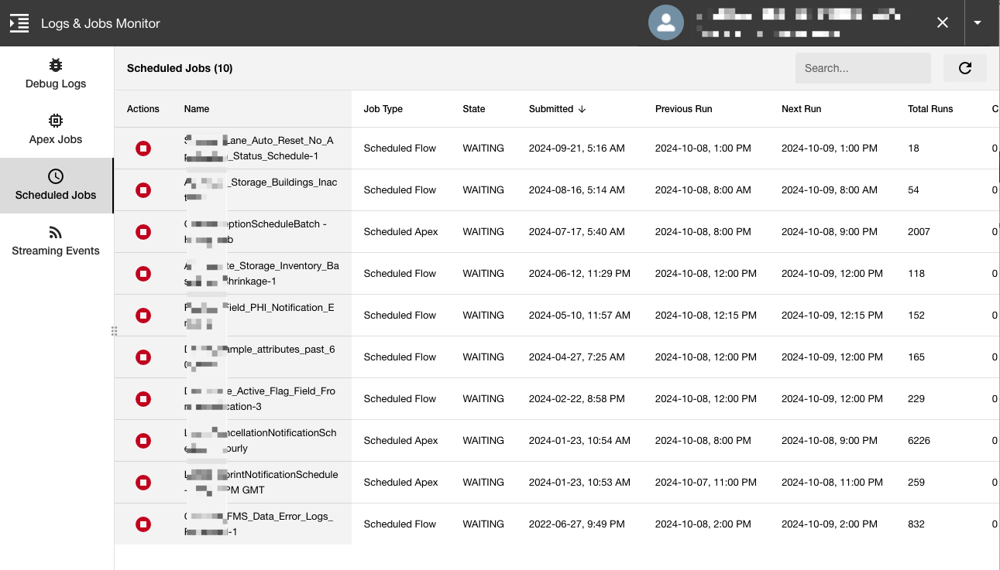
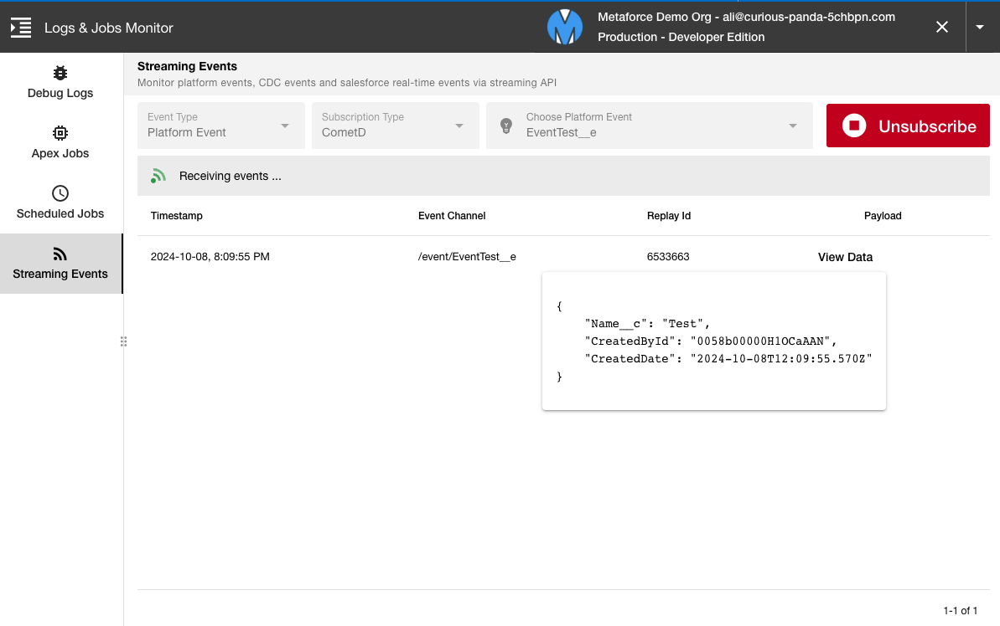

# Logs & Jobs Monitor

Logs & Job Monitor helps you to view and manage salesforce logs and jobs in one place.

## Debug Logs

-   Quickly create/Edit debug levels.
-   Quickly set a new track flag for an user.
-   Manage all existing track flags and easily view status.
-   Refresh and show latest debug logs and open them by a single click.
-   Clean all debug logs by a single click.

## Apex Jobs

View all apex jobs in a single view. It lists all key informations for the apex job so that you can easily find the apex job you're looking for.

The view includes 4 apex job types in total:

-   BatchApex
-   Future
-   Queueable
-   ScheduledApex

## Scheduled Jobs

View all scheduled jobs in a single view.

The view includes following scheduled job types:

-   Data Export
-   Dashboard Refresh
-   Reporting Snapshot
-   Scheduled Flow
-   Scheduled Apex
-   Report Run
-   Batch Job

## Streaming Events

In metaforce, you can easily subscribe your platform events or CDC(change data capture) events. When you click the "Subscribe" button, Metaforce subscribes the event object you selected via cometD protocol.

For example, let's say you have a platform event "EventTest\_\_e" in your org. You can subscribe the event in Metaforce and publish an event via apex script below:

> `EventTest**e evt = New EventTest**e(Name\_\_c='Test');`  
> `EventBus.publish(evt);`

