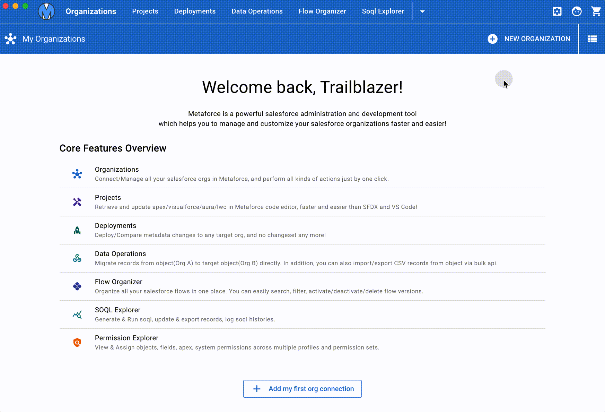
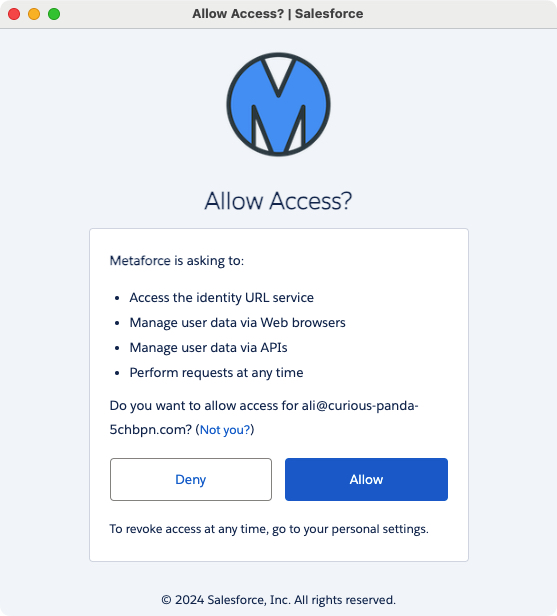
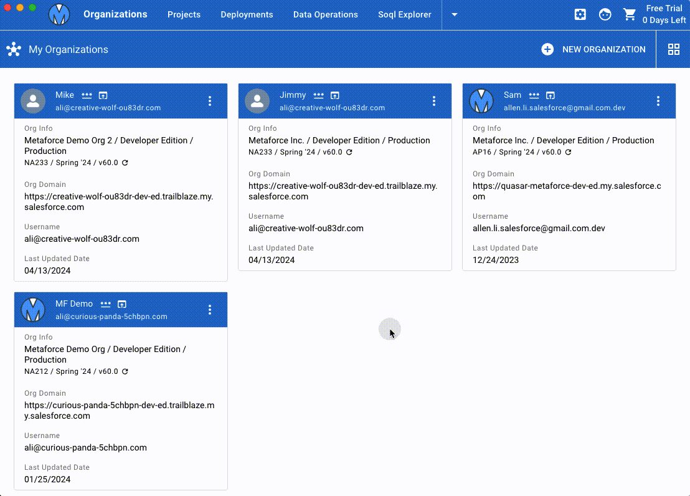

# Organizations

Metaforce connects all your salesforce organizations via [`Standard Salesforce OAuth2.0`](https://help.salesforce.com/s/articleView?language=en_US&id=sf.remoteaccess_oauth_web_server_flow.htm&type=5).

See how to add a new org connection in Metaforce:

1. Click `New Organization` and Choose `Sandbox` or `Production` to login.
2. Metaforce redirects you to standard salesforce login page, and authorize your salesforce account securely.
    > Metaforce hosts its own salesforce connected app to connect your salesforce accounts.
3. Once the salesforce account is authorized, the page will be redirected to the `Allow Access` page to request your permit for api permissions.
4. Click `Allow` to authorize Metaforce to perform salesforce api requests. > All your account credential info (username, org, access_token, refresh_token) are stored as local cache files in Metaforce app.

## Securely connect via OAuth

When adding a new org connection, Metaforce seamlessly directs you to the standard Salesforce login page, prompting you to grant the required access.  
After successfully authorizing your Salesforce account, Metaforce securely stores your account information, access token, and refresh token as JSON data on your local computer, displaying it as an org card within the Metaforce app.

> The account credentials obtained through OAuth are exclusively stored on your local computer, allowing you the flexibility to revoke or delete them at your convenience.

## Sort & Group Orgs

In Metaforce, you can organize multiple org connections effortlessly through drag-and-drop functionality. Additionally, you have the option to group your orgs by the org company name.

## Available Org Actions

### Open In Browser

Login your salesforce organization in browser by one click.  
Once you authorize salelsforce orgs, you can directly login the salesforce from metaforce. `No password and MFA Anymore!`

### Switch To Classic Org

Auto switch your salesforce org from lightning experience to classic.

### Copy Login Link

Get a login link and paste the link in the browser, then your salesforce org can be accessed as you without password login.

> Notes: please only share this link with someone you trust since it’s logged as your account!

### Copy AccessToken

AccessToken can be used in all salesforce apis, like rest/metadata/tooling. When you build salesforce integration, you can easily copy access token here and test your apis.

> Notes: please only share AccessToken with someone you trust since it’s logged as your account!

### Reset Password

Instead of sending new password email, you can set a new password for a particular user directly by following the password policy of your company.

> In `Reset Password` window, you can generate a random password which is a mixture of letters, numbers and some special characters like @,#,$,\*, etc.

### Secret Notes

Put your important/secret stuff here so that you can find them someday in future, like your password, or security token, etc.  
But some other tools still need you to login with the username and password, like dataloader, trailhead, etc. You can store them as secret notes in metaforce and find them wheneven you need them.

### Re-Authorize

The org connection can be disconnected somehow, like sandbox refresh, user deactivation, etc. You can re-authorize the org and it will be connected again.

### Revoke Connection

Your org connections are stored securely on your local computer. But you can revoke your org connection in Metaforce if you have to.
