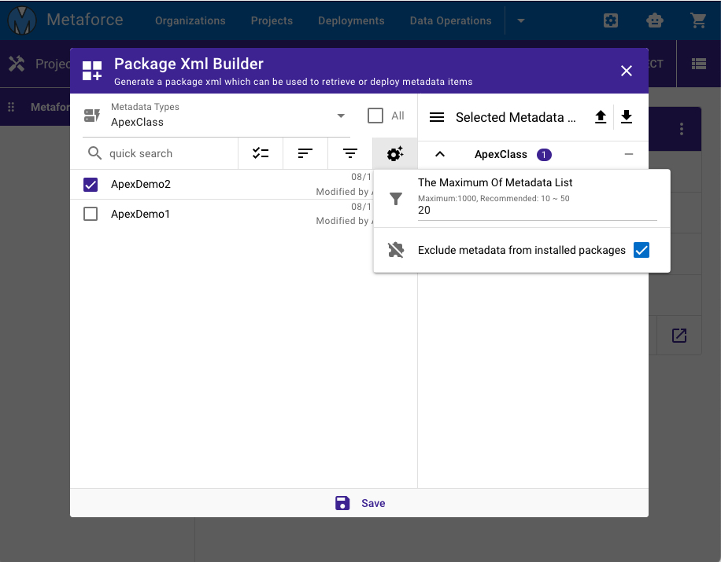
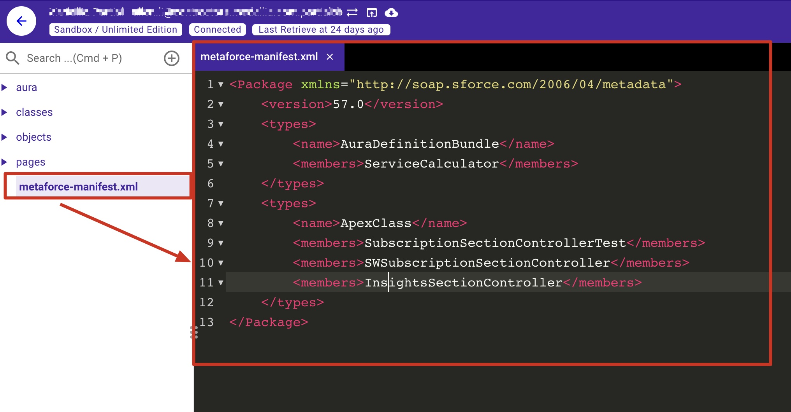

# Projects

Metaforce Project is a lightweight and powerful code editor for salesforce development.  
Compared to VS Code, `Metaforce Code Editor` has a user friendly interface and provides many handy actions, like code comparison, test execution, etc.

## Package XML Builder

In salesforce, a `package.xml` file defines the components that you’re trying to retrieve or deploy.  
Here is a simple package xml file:

    <?xml version="1.0" encoding="UTF-8"?>
    <Package xmlns="http://soap.sforce.com/2006/04/metadata">
        <types>
            <members>MyCustomObject__c</members>
            <name>CustomObject</name>
        </types>
        <types>
            <members>*</members>
            <name>CustomTab</name>
        </types>
        <types>
            <members>Standard</members>
            <name>Profile</name>
        </types>
        <version>58.0</version>
    </Package>

To build/update a package xml, you can use `Package XML Builder` to quickly choose components and save/export as a package xml file.

## metaforce-manifest.xml

Instead of package.xml, Metaforce Project use its own xml file named `metaforce-manifest.xml` to retrieve metadata components under the project.

> Notes: the usage of `metaforce-manifest.xml` is totally same with the `package.xml`.

-   The metaforce-manifest.xml file is `auto generated` while you create a new project.
-   The metaforce-manifest.xml file can be `updated via Package XML Builder`.
-   The metaforce-manifest.xml file can be `retrieved to refresh its all components`.
    

## Code Editor Actions

### Save On Local (Cmd + S)

> Save your changes on local file only. The grammar check/validation won't be applied.

### Save To Salesforce (Cmd + Shift + S)

> Save your changes to salesforce server.

### Refresh From Salesforce (Cmd + Shift + R)

> Fetch latest metadata content from salesforce server.

### Run Apex Test

There are 2 ways to run an apex test class:

1. `Run Quick Test`: run apex test methods only without generating code coverage. It can be used to quickly validate if your test methods have any exception during execution.
2. `Run Test`: run apex test methods and generate code coverages.

> Tips: When writing apex test class, you can use "Run Quick Test" to test if all test methods can be executed successfully. Then, use "Run Test" to check if the code coverage is sufficient for the deployment.

### Show Apex Coverage

> Show apex coverage percentage and highlight covered code lines in code editor. Please always ensure your apex code coverage is great than 75% at least.

### Open In Salesforce (Cmd + Shift + O)

> Show apex coverage percentage and highlight covered code lines in code editor.

### Diff With Target Org

> See a diff between current apex code and the same apex in the target org you select.

### View References

-   View components which are referenced by current component.
-   View components which reference to current component.

### View Console Logs (Cmd + Shift + L)

> Show code editor logs

### Format Code (Cmd + Shift + F)

> Quick format your apex, html, js, xml, etc.

### Editor Font Size

> Change font size in code editor.

### Editor Themes

> Change the theme of code editor.
