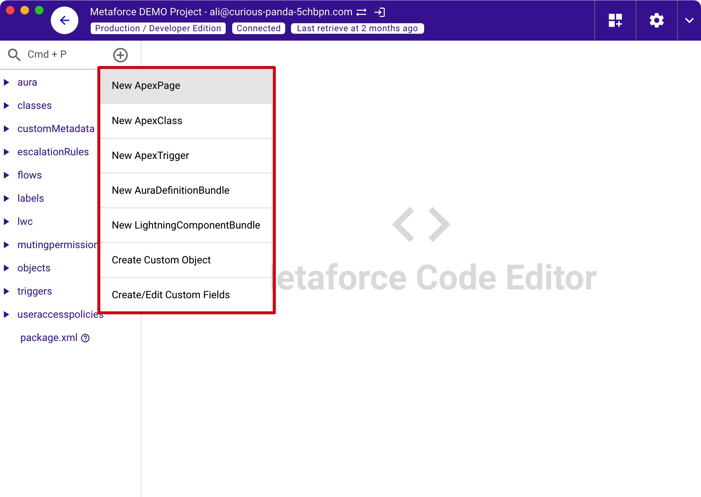

# Projects

## What's Metaforce project?

Metaforce Project is a place where you can start salesforce development work. In the project, you can retrieve and edit your apex code, aura/lwc component, object & fields definitions, even flow versions.  
Besides code development, you can even edit metadata file and save changes to salesforce directly, like object & field xml, lightning page xml, etc.

> Metaforce Project is totally compatible with the SFDX project in visual studio code. You can add an existing SFDX project in the metaforce directly as below.  
> In this way, you can easily switch project between Metaforce or VS Code, and utilize all metaforce features without losing SFDX abilities.
> 

## Project Code Editor

-   **Project Header** - includes org connection and its status, org switch button, org login button, package xml builder, code editor settings.
-   **Project Sidebar** - shows all files under the project.
-   **Project Code Editor** - view and edit salesforce files.
-   **Project Action bar** - all available actions for the code editor.

### Code Editor & Settings

-   Auto apex completion.
-   Various editor themes.
-   Common code editor settings, like themes, font size, etc.

### Code Editor Actions

In metaforce code editor, you can `view, update, save, and refresh` your salesforce metadata directly which includes apex classes, aura, lwc, custom objects, custom fields, email templates, etc.

### LF & CRLF

Show the line ending of current code content. Click to switch the line ending between LF and CRLF.

### Format Code

-   For ApexCode/LWC/Aura, they're formatted via the most popular plugin: [prettier-plugin-apex](https://github.com/dangmai/prettier-plugin-apex)
-   For javascript/Xml/Css, they're formatted via prettier plugin: [prettier-plugin](https://prettier.io/)

> Shortcut for windows: Ctrl + Alt + F  
> Shortcut for mac: Cmd + Shift + F

## Create Apex/Aura/LWC/Object/Field

In metaforce project, you can easily create new metadata item as below, like new visualforce page, apex class, etc.

## Package XML Builder

To create/update a package xml, use the powerful `Package XML Builder` to quickly pick any metadata components in seconds. It supports 100+ metadata types, and you can easily search, sort, add metadata items by few clicks.

### What's the package xml

In salesforce, the `package.xml` file defines the components that you’re trying to retrieve or deploy. Metaforce project also use package.xml to retrieve metadata components under the project. It's auto created by default when you add the project.

Here is a simple package xml file:

    <?xml version="1.0" encoding="UTF-8"?>
    <Package xmlns="http://soap.sforce.com/2006/04/metadata">
        <types>
            <members>MyCustomObject__c</members>
            <name>CustomObject</name>
        </types>
        <types>
            <members>*</members>
            <name>CustomTab</name>
        </types>
        <types>
            <members>Standard</members>
            <name>Profile</name>
        </types>
        <version>58.0</version>
    </Package>

### Add metadata Manually

The "Package Xml Builder" helps you to add metadata items by few clicks. It's similar to the salesforce change set but much easier and faster.  
You can filter, sort metadata items by choose a particular metadata type, then find metadata items by searching some keywords directly.

### Auto detect metadata changes

If you have too many changes recently and coudn't recall them, will you go back to salesforce and review all your changes from the beginning? Of course, you don't have to do that!  
The "Package Xml Builder" can detect all changes from a specified user, based on the date you choose. It scans 100+ metadata types and find changes.

> Notes: the usage of `package.xml` is totally same with the `package.xml`.

-   The package.xml file is `auto generated` while you create a new project.
-   The package.xml file can be `updated via Package XML Builder`.
-   The package.xml file can be `retrieved to refresh its all components`.

