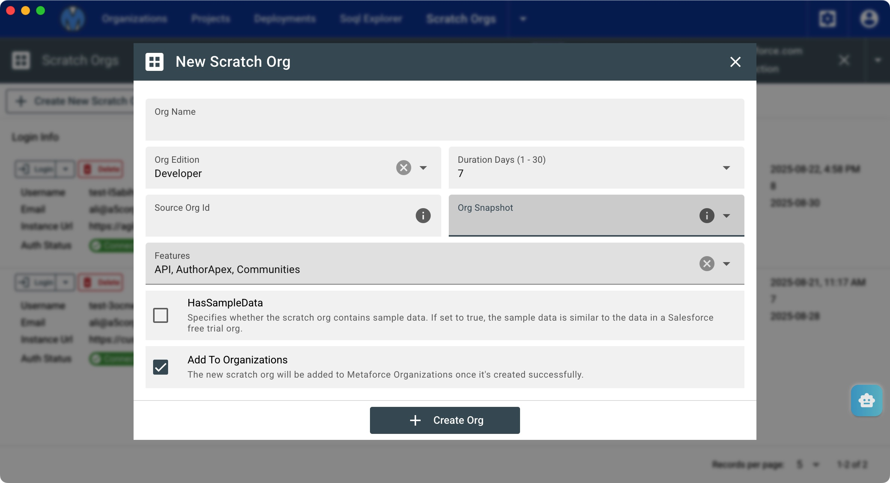
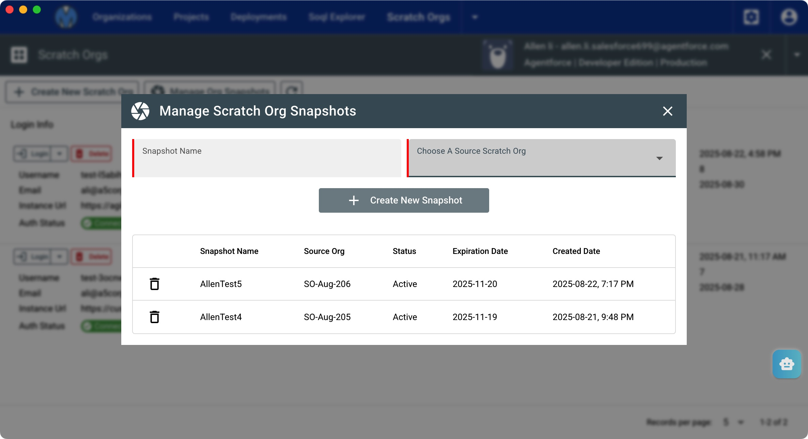
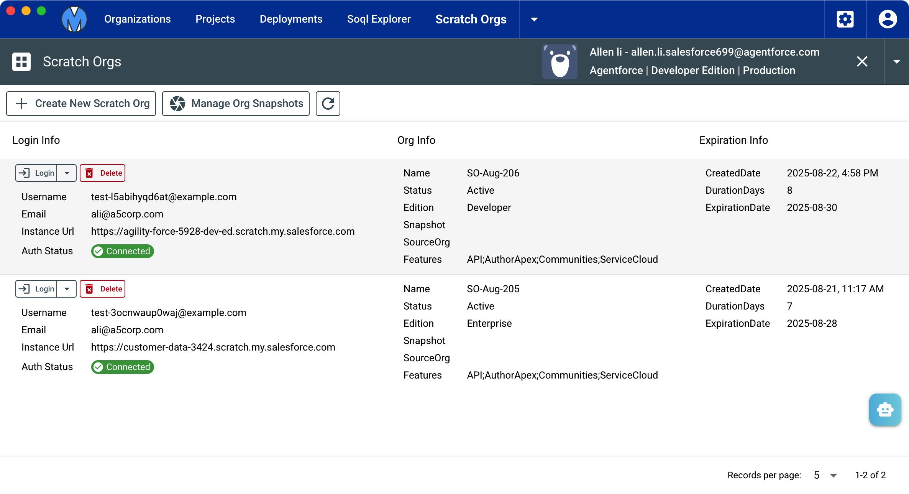

# Scratch Orgs

Instead of SFDX command, Metaforce help you manage all your scrach dev orgs within a more optimized UI design.

# Create new scratch org

-   Org Name: set new scratch org name.
-   Org Edition: Valid values are Developer, Enterprise, and Professional.
-   Duration Days: Number of days after which the scratch org expires. Valid values are 1–30. The default is 7.
-   Source Org Id: The ID of the org whose shape (features, settings, limits, and licenses) information is used for creating scratch orgs. If you specify SourceOrg, you can’t specify Edition or Snapshot.
-   Org Snapshot: If this scratch org was created from a scratch org snapshot, then this field contains either the name or ID of the snapshot. Specifically, the name corresponds to the Name field of the snapshot’s record in the OrgSnapshot standard object; the ID corresponds to the record ID.
-   HasSampleData: Specifies whether the scratch org contains sample data. If set to true, the sample data is similar to the data in a Salesforce free trial org.
-   Add To Organizations: The new scratch org will be added to Metaforce Organizations once it's created successfully.

# Create new org snapshot

-   Choose a scratch org and take an org snapshot from it.
-   when you create a new scratch org, you can choose an org snapshot as a template.

# Scratch Org Login/Re-Auth

Once you add a scratch org successfully from Metaforce, it will auto authorize your scratch org info.
As the screenshot shows, you can login to scratch orgs easily via a single click.

