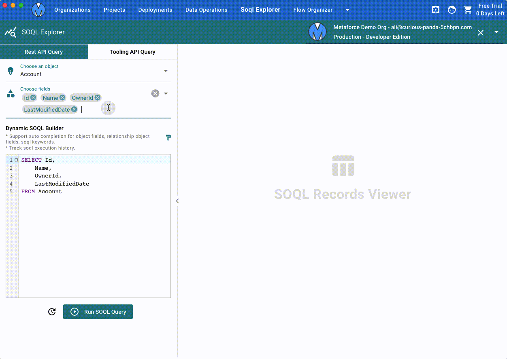
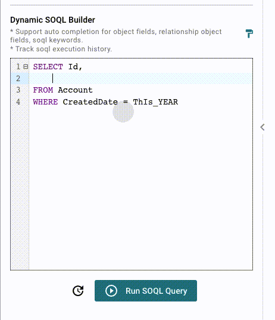
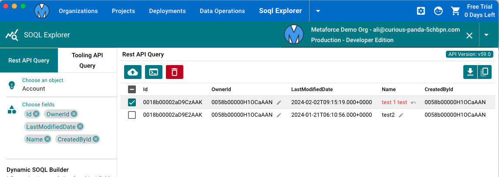
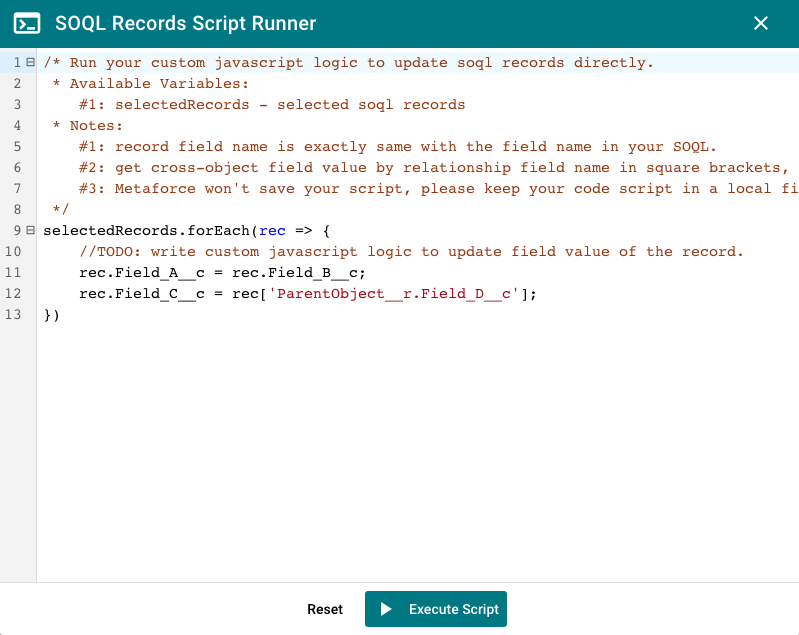

# SOQL Explorer

SOQL Explorer helps you to query, update salesforce records via rest api or tooling api.

## Dynamic SOQL Builder

Dynamic SOQL Builder is a powerful salesforce soql editor. It auto-complete fields, soql keywords when you type the soql manually.

## SOQL Records Viewer

Click `Run SOQL Query` to execute a soql query and view records as below.  
In this view, you can

-   Update/Delete records which are returned via rest api query
-   Export records as csv file

## Custom Script Runner

For query results, you can update them one by one manually.
But if you need to bulk update field values based on some logic, you can use `Custom Script Runner` to run a javascript code.

