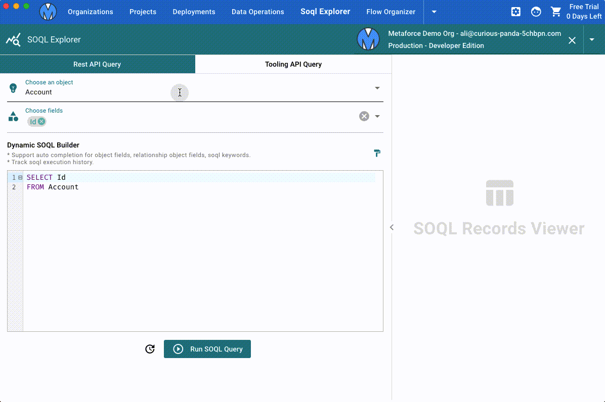
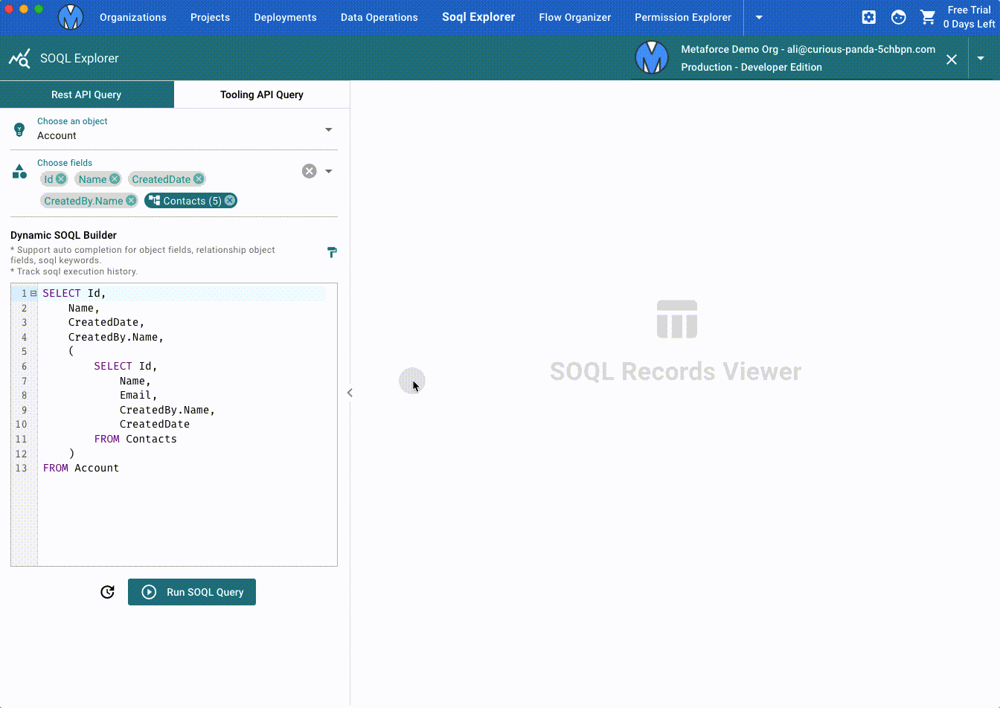
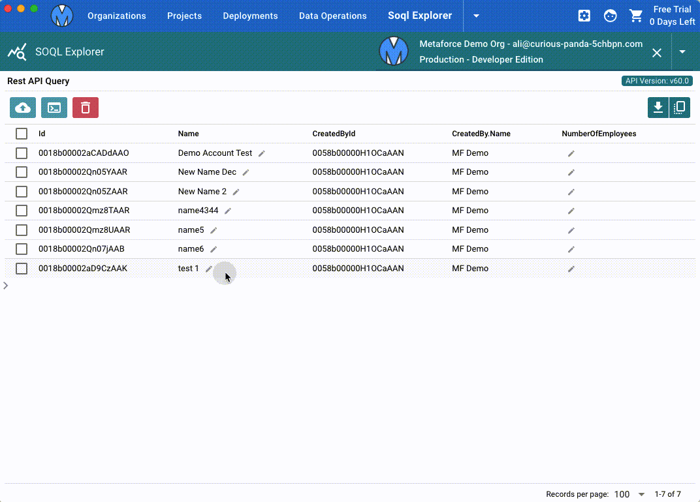

# SOQL Explorer

SOQL Explorer helps you to generate any SOQL query and view/update salesforce records via rest api or tooling api.


## Dynamic SOQL Builder

Dynamic SOQL Builder is a most powerful tool to generate salesforce SOQL in a super easy way.

-   Click to add obejct fields, parent object fields, child object fields to generate SOQL.
-   Edit SOQL in the editor via fields & keywords auto completion.
-   Format SOQL and track soql execution history.


## SOQL Records Viewer

Click `Run SOQL Query` to execute a soql query and view records as below.  
In this view, you can

-   View relationship field value and child object records directly.
-   Update/Delete records which are returned via rest api query.
-   Export records as csv file.



## Custom Script Runner

The custom script runner is used to bulk update field values via your customized javascript logic.

```javascript
/* Run your custom javascript logic to update soql records directly.
 * Available Variables:
    #1: selectedRecords - selected soql records
 * Notes:
    #1: record field name is exactly same with the field name in your SOQL.
    #2: get cross-object field value by relationship field name in square brackets, like rec['Account.Name'].
    #3: Metaforce won't save your script, please keep your code script in a local file or somewhere.
 */
selectedRecords.forEach(rec => {
    rec.Field_A__c = rec.Field_B__c ; // overwrite field A with field B
    rec.Field_C__c = rec['ParentObject__r.Field_D__c']; // overwrite field C with parent object field "Field D"
})
```


