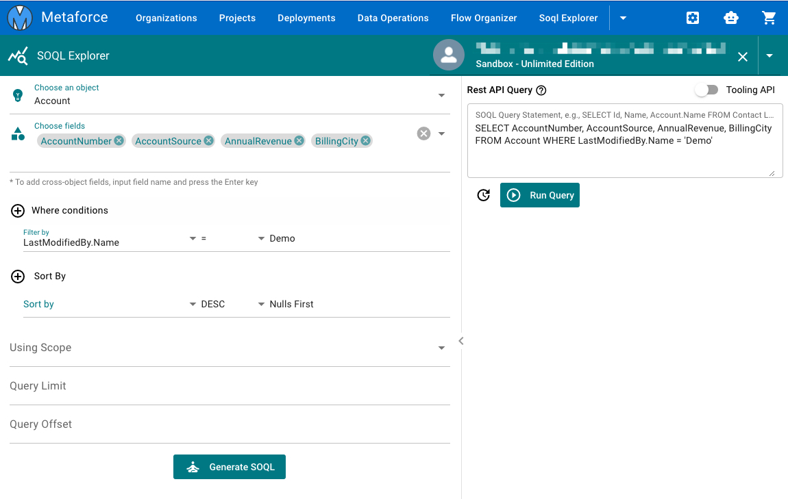
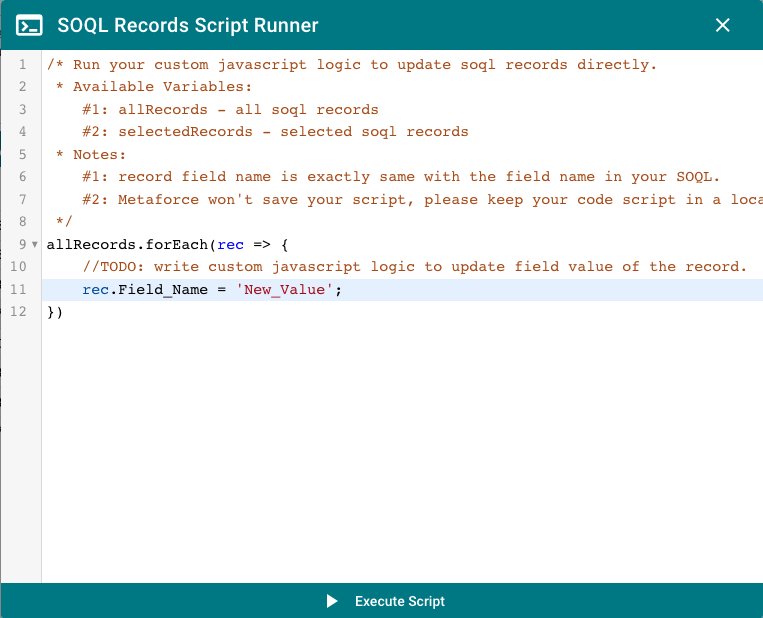

# SOQL Explorer

## SOQL Builder

With the SOQL Builder, you can easily build a basic soql query just by few clicks.

> For cross-object field reference, you can directly input the reference field name and press `Enter`. The field name will be directly added as a field under the 'Choose fields' dropdown list.

## SOQL Runner

Click `Generate SOQL` to generate a soql query in the textarea and you can also manually update the soql query. Once your query is ready, click `Run Query` to get query records as below.

## Custom Script Runner

For query results, you can update them one by one manually. But if you need to bulk update field values based on some logic, you can use `Custom Script Runner` to run a javascript code.

