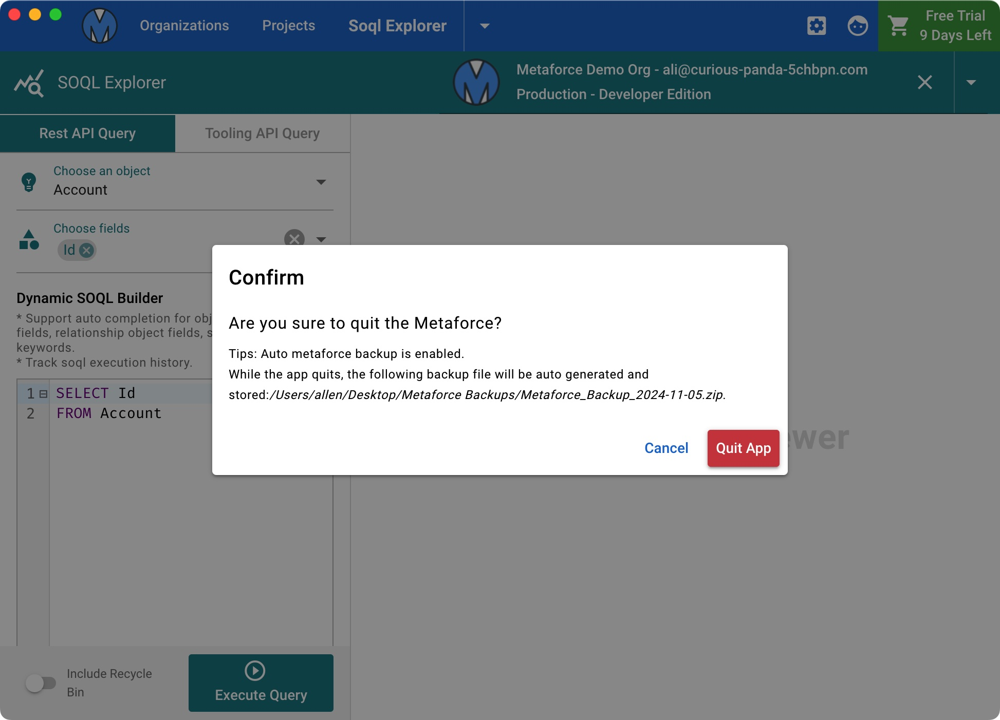

# Backup & Restore

Metaforce is a local tool and save all your data as local cache files under the application.  
To ensure all your important data are never lost, it's recommended to backup the metaforce data regularly. In this way, you can easily recover metaforce data and settings via the backup file.

### Manually Backup

You can manually export a backup zip file via `App Settings -> Backup/Restore Metaforce`, then click the "Backup Metaforce..." button. The backup will be exported as a Zip file. It includes all default settings, Organizations, Projects, Deployments, SOQL Histories, Apex Snippets, Data Operations, etc.

### Auto Backup

Choose a secure folder to auto backup metaforce before the app quits. The backup file will be stored on daily basis, for example, "Metaforce_Backup_2024_01_01.zip".
When you quit the app via `App Setting -> Quit` or `press "Ctrl/Cmd + Q" to quit the app`, you will see a tip about auto backup.

### Restore Metaforce

When you delete or lost your org connections or other data by accident, click the "Restore Metaforce..." button and choose the backup zip file. The metaforce will be recovered immediately.
