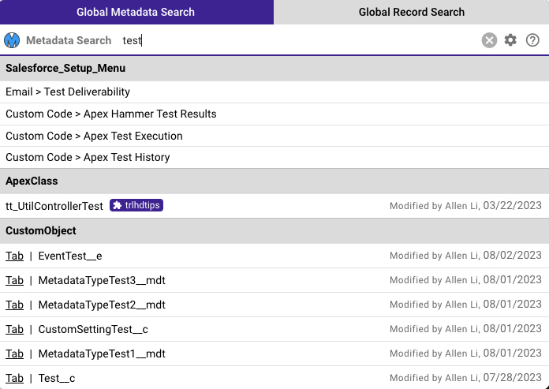
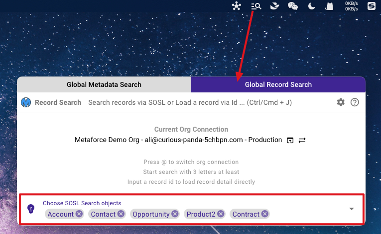
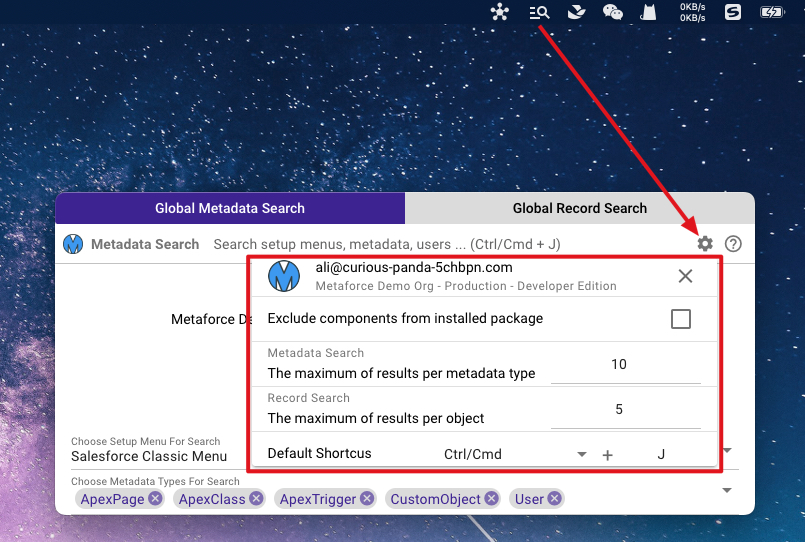

# MenuBar Plugins

Metaforce provides 2 powerful app plugins on the top MenuBar(Mac) or TaskBar(Windows).

-   **Global Orgs Hub** - Quickly `login your salesforce account` in browser at anytime, from anywhere!
-   **Global Org Search** - Quickly `search any salesforce metadata` and open metadata in browser at anytime, from anywhere!

## Global Orgs Hub

This plugin lists all your organizations in a quick popup so that you can `always login salesforce account by only one step`.  
To open the plugin, click the plugin icon on the menu bar or press the shortcuts `Cmd/Ctrl + Shift + M`.

    
Windows

    
Mac

## Global Search

This plugin helps you to search salesforce menus, users, apex, other various metadata types by only one step.

There are 2 search modes:

-   **Global Metadata Search** - search objects, apex classes, pages, profiles, users, etc.
-   **Global Record Search** - search all records via SOQL or show particular record detail via record ID.

> Tips:
>
> 1.  Press `Cmd/Ctrl + Shift + J` to quickly start the search. You can customize your own shortcuts in settings.
> 2.  Type `@` in search input box to quickly switch the org connection.
> 3.  The org connection is `auto switched to the most recent org you used` before starting search. This ability ensures the plugin always use the right salesforce org you want, and perform a real-time search immediately.

### Global Metadata Search

Before you start,

1. Choose the setup menu type
    - **Salesforce Classic Menu** - Search classic setup menu items.
    - **Salesforce Lightning Menu** - Search lightning setup menu items.
    - **None** - Don't search salesforce setup menu items.
2. Choose metadata types you usually search. - For example, CustomObject, ApexClass, ApexPage, LWC, Flow, Profile, User, etc.
 

     
Windows

     
Mac

 

3. Start a search and all you want are listed right away! Easy and Fast!
   

### Global Record Search

Global Record Search support 2 types of search:

-   `Text Search` to find records across all objects you choose` via SOSL.
-   `ID Search` to show all field values for a particular record.
    -   All record field values are listed.
    -   Click field label to open view the field in salesforce.
    -   Edit field values and save the record directly.

Before you start,

1. **Click `Global Record Search` on the plugin top bar**, then you're on "Global Record Search" mode.
2. Choose `SOSL Search Objects` to define which objects will be searched.
   

**Record Search Exmaple:**

    
Text Search Result

    
Id Search Result

### Global Search Settings

Configure your search settings to make your search faster and easier.

-   **Exclude Metadata from installed package** - Don't search metadata from installed packages.
-   **Metadata Search - The maximum of results per metadata type** - the recommended number is 10 ~ 20. This will reduce the volume of search results and make the search faster.
-   **Record Search - The maximum of results per object** - the recommended number is 5 ~ 10. This will reduce the volume of search results and make the search faster.
-   **Default Shortcus** - Customize the shortcuts as you like.

