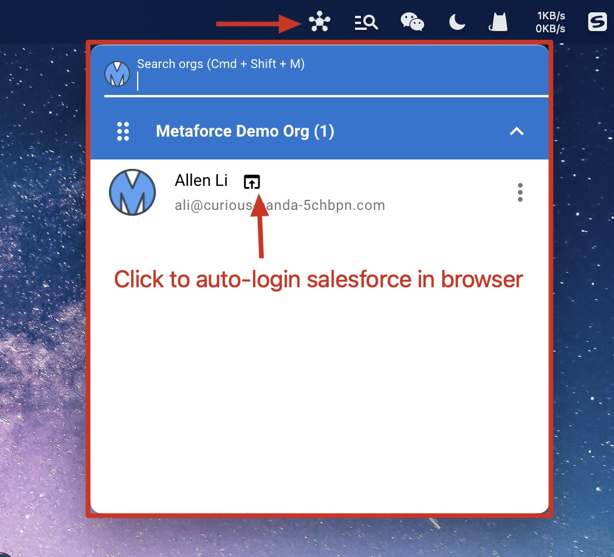
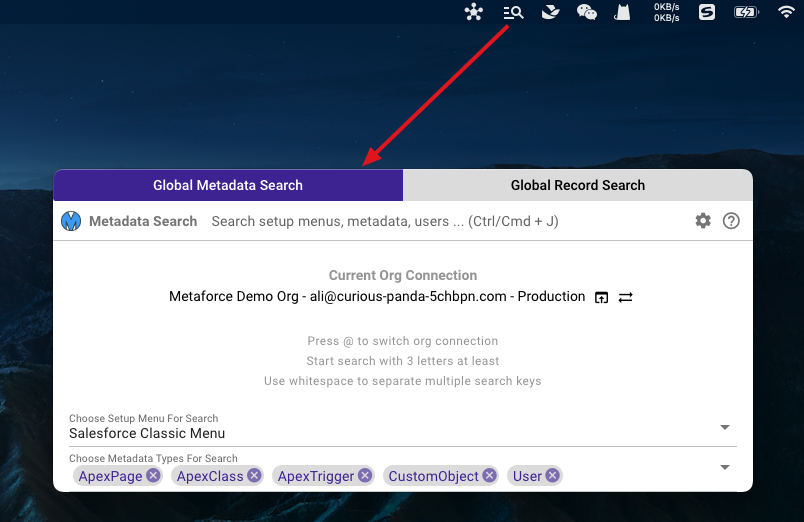

# MenuBar Plugins

Metaforce provides 2 powerful app plugins on the top MenuBar(Mac) or TaskBar(Windows).

-   **Global Orgs Hub** - Quickly `login your salesforce account` in browser at anytime, from anywhere!
-   **Global Org Search** - Quickly `search any salesforce metadata` and open metadata in browser at anytime, from anywhere!

### Global Orgs Hub

To open the plugin, click the plugin icon on the menu bar or press the shortcuts `Cmd/Ctrl + Shift + M`.  

### Global Org Search

To open the plugin, click the plugin icon on the menu bar or press the shortcuts `Cmd/Ctrl + Shift + J`.

1.  In global org seach window, you can pre-select metadata types you usually search. For example, apex, lwc, flow, user, etc.

    > The org connection is auto switched to the most recent org you used in metaforce app.
    > This ability ensures the plugin always use the right salesforce org you want, and perform a real-time search at anytime.

    

2.  Customize org search to make your search faster and easier.

    -   **Exclude components from installed package**
    -   **The maximum of results per search type** the recommended number is 10 ~ 20. This will reduce the volume of search results and make the search faster.
    -   **Default Shortcus** - Customize the shortcut as you like.

    
