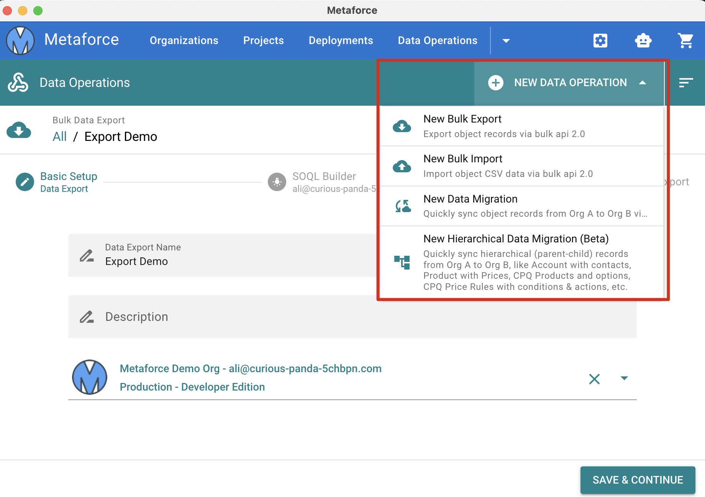

# Getting started

Welcome back, trailblazer!  
Follow steps below to quickly walk through metaforce core features!

## Add a salesforce org

> **How does metaforce safely manage your salesforce account?**  
> Metaforce authorize your salesforce account securely via [Standard Salesforce OAuth Process](https://help.salesforce.com/s/articleView?language=en_US&id=sf.remoteaccess_oauth_web_server_flow.htm&type=5).  
> Once your salesforce account is authorized successfully, the credential info will be stored as local files which only metaforce can read.

1. Open Metaforce app, click `New Organization` --> `Production`.  
   

2. Login your salesforce account from the standard salesforce login popup window.

    > If your account MFA is enabled, please confirm your login request from your mobile device. This is only required for your first login in Metaforce.

    

        

        

    

3. View your salesforce org details as below.  
   Try to quickly open your salesforce org in browser by clicking the `Quick Login` icon or the action `Open Org In Browser`.  
   

## Start apex development

If you have added a salesforce organization in Metaforce, then congrats! You can start explore all core metaforce features.  
Now, let's build a project and meet powerful metaforce code editor.

1.  Go to `Projects` --> `New Project`, popuate project information and save it.
    -   Click `Build Package Xml` to choose metadata components via metaforce package xml builder.
    -   Click `Save & Retrieve` button to retrieve metadata components you selected directly.
        
2.  Click `Open Code Editor` action on project detail card. Edit and Save your apex code.  
    In metaforce code editor, you can create/refresh/update/compare apex, lwc, aura, object, fields and other metadata components directly.  
    

## Deploy your changes

In Metaforce, you can quickly deploy your metadata changes from source org to target org in real-time.

1.  Go to `Deployments` --> `New Deployment`, configure a deployment step.

    -   Step 1: populate deployment name and choose source & target orgs.
    -   Step 2: choose metadata components to be deployed.
    -   Step 3: configure deployment options (test level, diff changes, and deployment type.)
    -   Step 4: start deployment and monitor deployment status.

    

2.  Click "Start Deployment Now" and view deployment status.
    

## Bulk export account records

1.  Go to `Data Operation` --> `New Bulk Export`, then Populate the export name, salesforce org, object and fields.
    
2.  Review the export summary and start the export, then download the csv file.
    

## Quickly query and update accounts

1.  Go to `SOQL Explorer` --> `Choose an salesforce org connection`.
2.  Build your own soql via `SOQL Builder` on the left side, click `Generate SOQL` button.
3.  You can also manually update the soql, like adding cross-object field. Click `Run Query` button.
    
